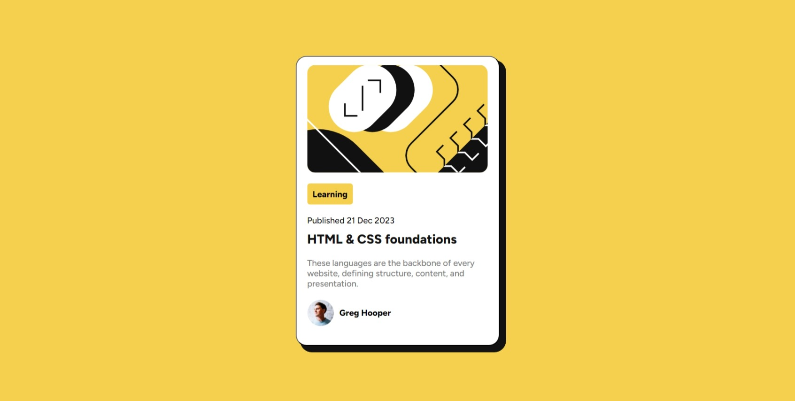

# Frontend Mentor - Social links profile solution

This is a solution to the [Blog preview card challenge on Frontend Mentor](https://www.frontendmentor.io/challenges/blog-preview-card-ckPaj01IcS). Frontend Mentor challenges help you improve your coding skills by building realistic projects.

## Table of contents

- [Overview](#overview)
  - [The challenge](#the-challenge)
  - [Screenshot](#screenshot)
  - [Links](#links)
- [My process](#my-process)
  - [Built with](#built-with)
  - [What I learned](#what-i-learned)
  - [Continued development](#continued-development)
  - [Useful resources](#useful-resources)
- [Author](#author)
- [Acknowledgments](#acknowledgments)

**Note: Delete this note and update the table of contents based on what sections you keep.**

## Overview

### The challenge

To build out blog preview card and get it looking as close to the design as possible.

Users should be able to:

- See hover and focus states for all interactive elements on the page

### Screenshot

### Links

- Solution URL: [git repo](https://github.com/CristiMiri/Social-links-profile)
- Live Site URL: [git page](https://cristimiri.github.io/Social-links-profile/)

## My process

### Built with

- Semantic HTML5 markup
- Flexbox
- CSS Selectors and variables

### What I learned

I learned how to box shadows,media queries and css variables.

### Useful resources

- [resource1](https://www.w3schools.com/css/default.asp) - This helped me with common use of css.
- [resource2](https://developer.mozilla.org/en-US/docs/Web/CSS) - This helped me with css variables and boxshadow.
- [resource3](https://stackoverflow.com/questions/8114657/how-to-style-the-parent-element-when-hovering-a-child-element) - This helped me change property of parent from child.

## Author

- Frontend Mentor - [@CristiMiri](https://www.frontendmentor.io/profile/CristiMiri)
